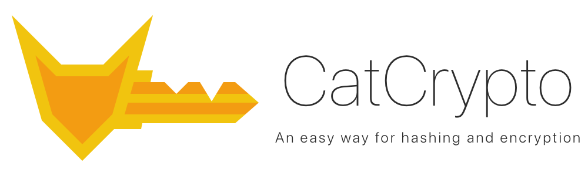

<p align="center">
	
</p>

<p align="center">
	
	<a href="http://cocoapods.org/pods/CatCrypto"></a>
	<a href="http://cocoapods.org/pods/CatCrypto"></a>
</p>

<p align="center">
	<a href="https://github.com/Carthage/Carthage"></a>
	<a href="http://cocoapods.org/pods/CatCrypto"></a>
</p>

<p align="center">
	<a href="https://travis-ci.org/ImKcat/CatCrypto"></a>
	<a href="https://codebeat.co/projects/github-com-imkcat-catcrypto-master"></a>
	<a href="https://imkcat.github.io/CatCrypto/"></a>
</p>

## Requirements

- Swift 4+
- iOS 8.0+
- macOS 10.10+
- tvOS 9.0+
- watchOS 2.0+

## Usage

CatCrypto include a series of hashing and encryption functions and more functions in progress!

## Support functions

- Hashing
	- Message-Digest
  		- [MD2](https://tools.ietf.org/html/rfc1319)
  		- [MD4](https://tools.ietf.org/html/rfc1320)
  		- [MD5](https://tools.ietf.org/html/rfc1321)
  		- [MD6](http://groups.csail.mit.edu/cis/md6/)
	- [Argon2](https://github.com/P-H-C/phc-winner-argon2)

## Installation

CatCrypto is available through [CocoaPods](http://cocoapods.org) and [Carthage](https://github.com/Carthage/Carthage).

### CocoaPods

Add the following line to your Podfile:

```ruby
use_frameworks!

pod 'CatCrypto'
```

### Carthage

Add the following line to your Cartfile:

```ruby
github "ImKcat/CatCrypto"
```

## Documentation

[API Reference](https://imkcat.github.io/CatCrypto/)

## License

CatCrypto is available under the MIT license. See the LICENSE file for more info.
